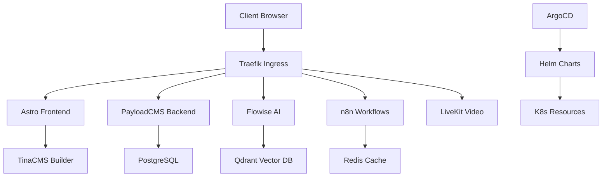

# Architecture CoachLibre MVP

## Vue d'ensemble

## Stack Technique

| Composant | Technologie | Rôle |
|-----------|-------------|------|
| Frontend | Astro + React | Site vitrine + SPA |
| CMS | PayloadCMS | API + Admin |
| IA | Flowise + Qdrant | Assistant conversationnel |
| Workflows | n8n + CrewAI | Automatisation métier |
| Video | LiveKit | Visioconférence |
| Orchestration | K3s + ArgoCD | Container + GitOps |
| Monitoring | Prometheus + Grafana | Observabilité |

## Flux de Données

1. **Utilisateur** → Frontend Astro
2. **Frontend** → API PayloadCMS
3. **API** → Base PostgreSQL
4. **IA** → Qdrant (RAG) + Flowise
5. **Workflows** → n8n → Intégrations externes

## Sécurité

- TLS automatique (cert-manager)
- WAF Cloudflare
- RBAC Kubernetes
- Secrets management
